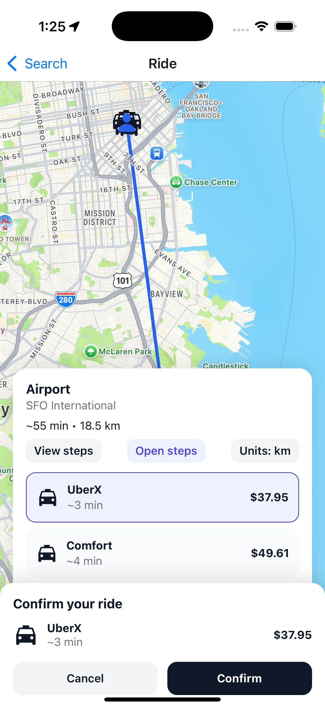

# 🚖 Uber Clone (React Native + Expo)

A mobile application inspired by Uber, built using **React Native** and **Expo**.  
This project replicates key features of Uber's user app including authentication, maps, ride booking, and profile management.

---

## 📱 Features
- 🔑 User Authentication (login / signup)
- 🗺️ Interactive Maps with real-time location
- 🚗 Ride booking flow (set pickup & destination)
- 👤 Profile screen with settings and preferences
- 📜 Ride history (stored with AsyncStorage)
- 🎨 Modern UI styled similar to Uber

---

## 🛠️ Tech Stack
- **React Native** (Expo framework)
- **TypeScript**
- **React Navigation** (for navigation)
- **AsyncStorage** (for local storage)
- **Ionicons** (icons)
- **Safe Area Context** (for notch-safe layouts)

---

## 🚀 Getting Started

### 1. Clone the repository
```bash
git clone https://github.com/aanchaltripathy/Uber-clone.git
cd Uber-clone
